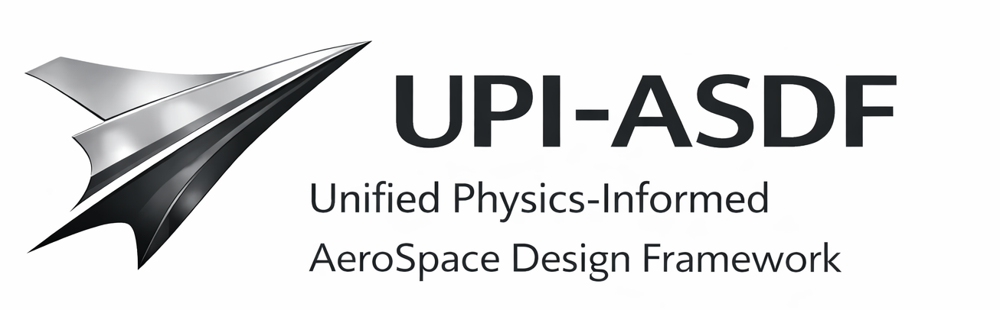

  

## Overview
PI-ASDF is a unified physics-informed AI framework for aero-space simulation
and inverse design, combining first-principles physics with data-driven models
to accelerate engineering workflows while preserving physical consistency.

## Key Features
- Physics-informed learning with conservation laws
- Multi-regime aerospace support (subsonic to hypersonic)
- Native inverse design capabilities
- Solver-aware integration with CFD
- Modular and reusable architecture

## Scope
PI-ASDF focuses on classical aero-space physics (fluid dynamics,
thermodynamics, heat transfer)
